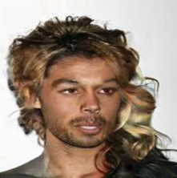
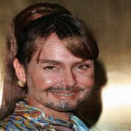
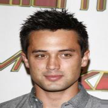
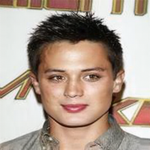
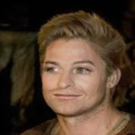
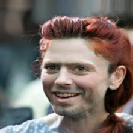
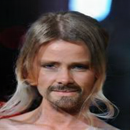
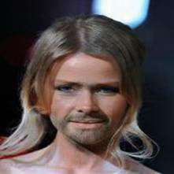

# 🧔 Beardo: A Realistic Beard Generator using CycleGAN + Model Pruning
CycleGAN-with-Co-Evolutionary-model-pruning

🚀 Final Project for "Efficient AI Model Design for Machine Learning and Inference"

🎨 Style Transfer × 💈 Facial Hair Simulation × 🧠 Efficient AI

# Project Objective
This project aims to design a creative and realistic AI application with an efficient model design.

We propose Beardo, a fun yet practical system that leverages CycleGAN to generate beards on clean-shaven faces.

To meet efficiency requirements, we integrate Co-Evolutionary Model Pruning to reduce computational load while maintaining performance.

# Motivation
Facial hair is one of the most transformative elements in personal appearance. Whether for fun, style previews, or entertainment applications, a beard generator could be useful and engaging.

Instead of simple filters, we use CycleGAN to perform image-to-image translation between two unpaired domains:
* Domain A: Faces without beards
* Domain B: Faces with beards

By doing this, the system learns to naturally synthesize facial hair that fits face structure and lighting.

# 🔁 CycleGAN
- Architecture: Dual generator + discriminator
- Goal: Unpaired image-to-image translation
- Dataset: [CelebA](https://mmlab.ie.cuhk.edu.hk/projects/CelebA.html)
- Reference: [Unpaired Image-to-Image Translation using Cycle-Consistent Adversarial Networks](https://github.com/junyanz/CycleGAN)

# 🪓 Co-Evolutionary Model Pruning
- Purpose: Reduce inference time and model size
- Method: Iteratively prune the generator while co-evolving architectures and weights
- Result: Efficient inference with minimal quality loss
- Reference: [Co-Evolutionary Compression for Unpaired Image Translation](https://arxiv.org/abs/1907.10804)

# Results
Beardo (2beard):
   Input	    | Output (Beard Added)
:-------: | :------:
 |   
 |  

Beardo (2nobeard):
 Input	    | Output (Beard Removed)
:-------: | :------:
 |   
 | 

Co-Evolutionary Model Pruning Result:

Efficient inference with minimal quality loss
 Before Pruning	    | After Pruning
:-------: | :------:
 |   
 | 

# Inference Result
Input	    | Output 
:-------: | :------:
 | 

